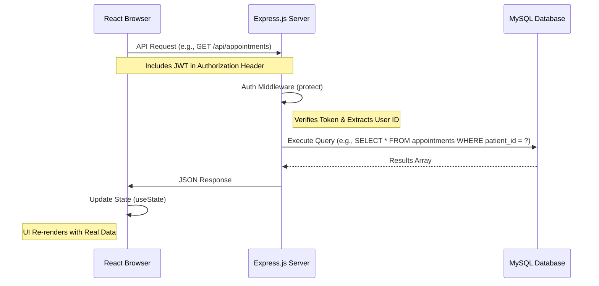

# Backend Documentation - Doctor Appointment System

This document details the server-side architecture, API structure, and database integration for the Doctor Appointment System.

## Technology Stack
- **Runtime**: Node.js
- **Framework**: Express.js
- **Database**: MySQL (MariaDB)
- **Authentication**: JSON Web Token (JWT)
- **Drivers**: `mysql2/promise`

## API Structure

### Auth Endpoints (`/api/auth`)
| Method | Endpoint | Description |
| :--- | :--- | :--- |
| `POST` | `/register/patient` | Creates a new patient user. |
| `POST` | `/register/doctor` | Creates a doctor user and associated profile. |
| `POST` | `/login` | Authenticates user and returns a JWT. |

### Doctor Endpoints (`/api/doctors`)
| Method | Endpoint | Description |
| :--- | :--- | :--- |
| `GET` | `/` | List all doctors (public). |
| `GET` | `/:id` | Get specific doctor details. |
| `GET` | `/stats` | (Protected) Get dashboard counts for a doctor. |
| `GET` | `/patients` | (Protected) List patients who have booked the doctor. |

### Appointment Endpoints (`/api/appointments`)
| Method | Endpoint | Description |
| :--- | :--- | :--- |
| `GET` | `/` | (Protected) List all user-related appointments. |
| `POST` | `/` | (Protected) Create a new appointment. |
| `PUT` | `/:id` | (Protected) Update appointment status. |
| `PUT` | `/:id/reschedule` | (Protected) Change appointment date/time. |

## Controller Logic
The backend uses a standard Controller pattern to separate routing from business logic.

- **`authController.js`**: Handles password hashing (bcrypt), token generation, and dual-table insertion for doctors.
- **`doctorController.js`**: Manages doctor-specific data, including availability stats and patient relationship queries.
- **`appointmentController.js`**: Core logic for booking, filtering by user role, and handling date-based queries (e.g., `CURDATE()`).

## React - Express - MySQL Flow

The following diagram illustrates how data travels through the system:

## Database Schema Highlights
- **`users`**: Central table for all accounts (role-based).
- **`doctors`**: Extends `users` with professional details (specialty, rating, bio).
- **`appointments`**: Links `patients` (from `users`) to `doctors`. Includes status tracking.

## Development & Maintenance
- **Initialization**: The `config/initDb.js` script automatically check for and creates the database and all required tables based on `schema.sql`.
- **Environment**: Configuration is managed via `backend/.env` for Port, DB credentials, and JWT secrets.
